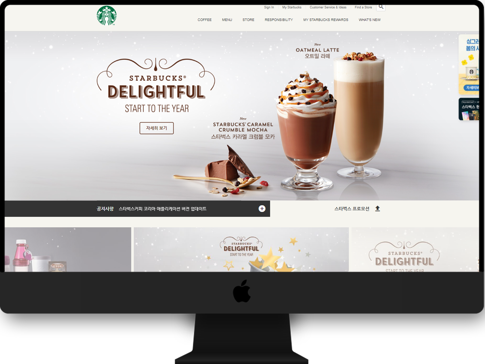

# 안녕하세요 신입 웹 프론트엔드 개발자 성해련 입니다.

 

### starbucks 클론 코딩

 

 

- Demo : http://rien.dothome.co.kr/starbucks/
  - pc 전용 페이지 입니다.

 

---

### 개발 목표
  - 다양한 프레임워크와 서비스 배포 방식을 익히는 학습을 진행함.

   

### 사용 기술
  - HTML
  - CSS
  - Javascript
  - Jquery

   

### 라이브러리
  - swiper
  - lodash
  - cookie
  - GSAP & ScrollToPlugin
  - Youtube API
  - ScrollMagic

   

